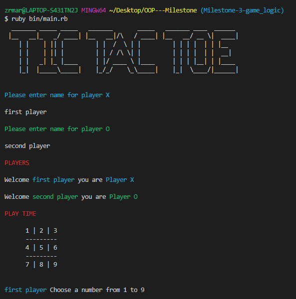
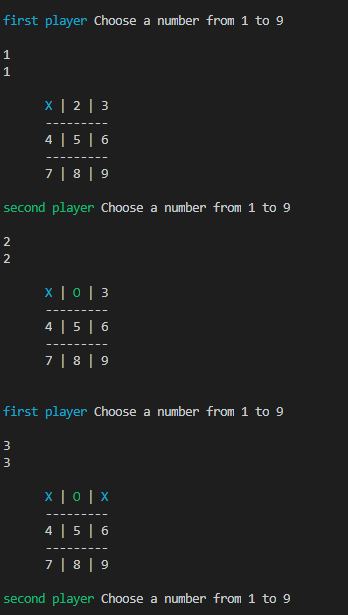
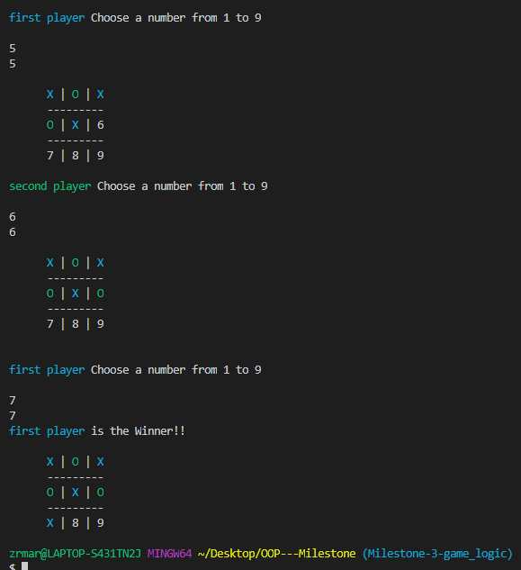

# [OOP TIC TAC TOE ]

- In this project, we built a Tic Tac Toe game. The main goal is to put into practice the main concepts of Object Oriented Programming. Particularly, classes and access to their attributes.

## TIC TAC TOE Instruccions

- Tic-tac-toe is a game for two players, X and O, who take turns marking the spaces in a 3×3 grid. The player who succeeds in placing three of their marks in a horizontal, vertical, or diagonal row is the winner.(wikipedia, n.d.)
 
## Setup

- Make a copy in your local enviroment(Clone the Git Repository)

- Open this directory in your terminal   (OOP---Milestone/bin)

- To run the game first install artii and colorize gems with this commands in your terminal
($ gem install artii) ($ gem install colorize) but if you already have installed the gem bundler($ gem install bundler) only run bundler and you are ready.

- You are ready to play only run this command in your terminal(ruby main.rb) if you are in (OOP---Milestone/bin) or (ruby bin/main.rb) if you are in (OOP---Milestone) 

## TIC TAC TOE (Game preview)

## Built With

- Ruby
- Colorize and artii gems
- Rubocop

## Prerequisites

- Browser (Google Chrome, Mozilla Firefox, Safari or any other browser)
- colorize and artii gems

## GitHub Repo

-  https://github.com/afcastaneda223/OOP---Milestone/tree/master

## Author

👤 **Andres Felipe Castañeda Ramos**

- Github: [@afcastaneda223](https://github.com/afcastaneda223)
- Twitter: [@afcastaneda](https://twitter.com/afcastaneda)
- Linkedin: [Andres Felipe Castañeda](www.linkedin.com/in/andres-castaneda223)

👤 **Rocio Martinez**

- Github: [@Rocio01](https://github.com/Rocio01)
- Twitter: [@rugiada8801](https://twitter.com/rugiada8801)
- Linkedin: [zulma-martinez-5247a31a8](https://www.linkedin.com/in/zulma-martinez-5247a31a8/)

## Show your support

Give a ⭐️ if you like this project!

## Acknowledgments

- Microverse
- Ruby
- The Odin project

## 📝 License

Distributed by the Creative Commons Legal Code. See `LICENSE` for more information.
